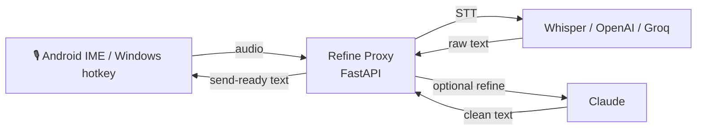

# Voice Keyboard

**Self-hosted voice input for Japanese — speak, and get send-ready text.**

Audio is transcribed (Whisper / OpenAI / Groq) and optionally refined by an LLM
(Claude) into tidy, ready-to-send Japanese — fillers removed, punctuation fixed,
proper nouns normalized — **while preserving your original tone** (です/ます ↔
だ/である ↔ casual). Everything runs on hardware you control; no third-party
dictation service ever sees your text.


---

## Why

Most speech-to-text tools mangle Japanese: they flatten honorifics, butcher
proper nouns, and leave you re-editing every dictation by hand. Voice Keyboard
puts a thin **refine proxy** between the STT engine and your text field. The
proxy keeps your tone intact, fixes homophones in context, normalizes 旧字体 →
新字体, and can inject a personal proper-noun dictionary so names and jargon come
out right. The result is text you can actually send.

## Download

Grab the Android APK from the
[**latest release**](https://github.com/yusukebass77/voice-keyboard/releases/latest)
(`voice-keyboard-v0.1.0.apk`), or build it from source (see below). You'll also
need to run the proxy.

## Demo

> 🎬 _Demo recording goes here — speak into the keyboard, watch raw STT get
> refined into clean, send-ready Japanese in ~2–3 s end-to-end._

## Architecture



The proxy is the brain: clients only record audio and paste the returned text.
That keeps refine logic, prompts, and the personal dictionary in one place, so a
client never needs to change when the pipeline improves.

## Components

| Dir | What it is |
|-----|------------|
| `proxy/` | **FastAPI server (original work).** Receives audio, runs STT, optional LLM refine / conversation mode, returns plain text. All keys via env vars. |
| `whisper-to-input/` | **Android keyboard (IME).** A GPL-3.0 fork of [j3soon/whisper-to-input](https://github.com/j3soon/whisper-to-input), extended with a custom keypad, a one-tap refine/style button, and a conversation mode. |
| `pc/` | **Windows client.** AutoHotkey + PowerShell — a hotkey to record, send to the proxy, and paste the refined text. |

## Features

- **Tone-preserving refine** — casual stays casual, polite stays polite; never silently rewrites your register.
- **Style modifiers** — one tap to force polite / casual / bullet / summary output.
- **Conversation mode** — talk to an assistant instead of dictating; optional TTS reply.
- **Multi-backend STT** — OpenAI `gpt-4o-transcribe` by default, Groq `whisper-large-v3-turbo` fallback.
- **Personal proper-noun dictionary** — inject names, places, and jargon so STT/refine gets them right (kept local, never committed).
- **Privacy-first** — self-hosted proxy; your audio and text stay on your infrastructure.

## Proxy quickstart

```bash
cd proxy
python -m venv .venv && source .venv/bin/activate
pip install -r requirements.txt

PROXY_SHARED_SECRET=choose-a-secret \
OPENAI_API_KEY=sk-... \
ANTHROPIC_API_KEY=sk-ant-...  \
uvicorn main:app --host 0.0.0.0 --port 9090
```

### Endpoints

| Method | Path | Purpose |
|--------|------|---------|
| `POST` | `/v1/audio/transcriptions` | OpenAI-API-shaped STT + refine (bearer auth) |
| `POST` | `/asr` | Whisper-ASR-Webservice-shaped STT + refine |
| `POST` | `/feedback` | Post-edit feedback (optional prompt-improvement loop) |
| `POST` | `/kanji` | Kana → kanji conversion candidates |
| `GET`  | `/health` | Backend availability |

### Configuration

| Var | Purpose |
|-----|---------|
| `PROXY_SHARED_SECRET` | **required** — bearer shared between clients and proxy |
| `OPENAI_API_KEY` | OpenAI STT + TTS |
| `GROQ_API_KEY` | Groq STT (fallback) |
| `ANTHROPIC_API_KEY` | Claude refine / conversation (optional) |
| `STT_PROVIDER` | `openai` (default) or `groq` |
| `BIND_HOST` / `BIND_PORT` | default `0.0.0.0:9090` |

## Personal dictionary

The refiner can read a proper-noun hint dictionary at
`dictionary/proper_nouns.json` to improve name/term recognition. **That
directory is git-ignored** — it holds personal names and terms, so each user
supplies their own. The prompts fall back gracefully when it is absent. See
`dictionary/` notes in the proxy for the expected shape.

## Android: build & install

The IME is a standard Gradle Android project under `whisper-to-input/android/`.
On ARM64 build hosts (e.g. Raspberry Pi), set a local `aapt2` override in an
un-committed `gradle.properties` (see the comment in that file). In the app's
settings, point the endpoint at your proxy and set **Postprocessing → No
Conversion** (the upstream default converts to Traditional Chinese, which breaks
Japanese output).

## Attribution & license

- `whisper-to-input/` is a fork of [j3soon/whisper-to-input](https://github.com/j3soon/whisper-to-input), licensed under **GPL-3.0**.
- The proxy and Windows client are original work.
- This repository as a whole is released under **GPL-3.0** — see [`LICENSE`](LICENSE).
